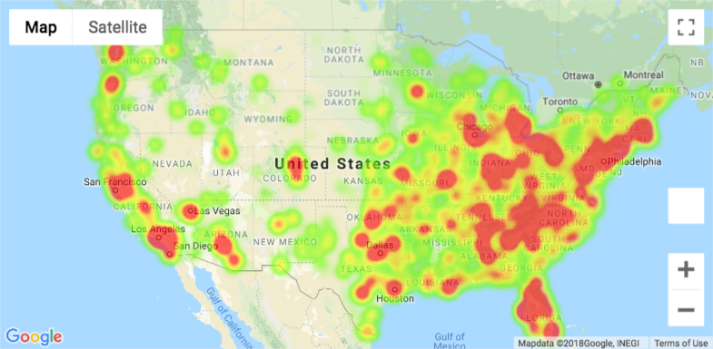
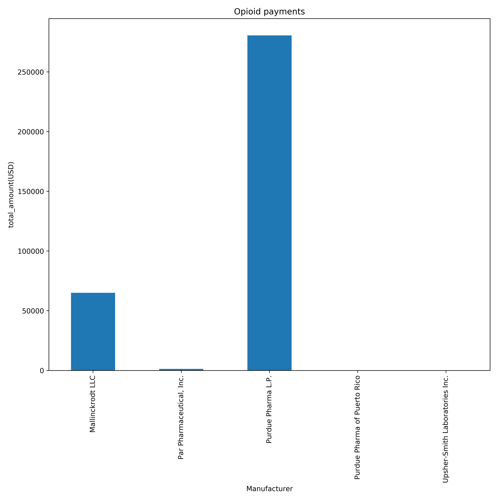

# Analysis of Opioid Prescription Patterns and Drug Overdose Deaths

### Introduction

“Opioids” are the class of drugs which are naturally found in the poppy plant. They are often used and prescribed by physicians as pain relieving medicine. Centre for Disease control and prevention (CDC)Injury centre looks at the deaths and non-fatal overdoses for four categories of opiods:

* Natural opioids which includes morphine and codeine and the semi-synthetic opioids which includes drugs like oxycodone,hydrocodone and hydromorphone and oxymorphone.
* Methadone, a synthetic opioid.
* Synthetic opioids other than methadone (drugs like tramadol and fentanyl).
* Heroin, an illicit (illegally made) opioid synthesized from morphine that can be a white or brown powder, or a black sticky substance.

Opioid prescriptions and sales have increased substantially in the US.

**AIM**

The main aim of our project is to determine the prescribing patterns of Opioids in USA in the year 2016.

### Methodology:

Selection of topic:

* Why this topic?
* Opioids are main cause of death in US
* Importance of data analytics in health care industry.

Opioid painkillers are supposed to provide pain relief, but there are many injuries and deaths because they have been inappropriately prescribed. With the use of analysis tools one can make useful inferences and predictions with the available data which will help the health care industries to improve the clinical outcomes.

*Source of information*:

The main source of information was from the website : https://www.cdc.gov/ and 
https://data.cms.gov/ .

Data Structure:

The data was available on the CMS and CDC websites and we used the available APIs to access the data:

* Socrata("data.cms.gov", "dLbTEKbMpc1G4L7fCsOvHvATT")
* Socrata("data.cdc.gov", "dLbTEKbMpc1G4L7fCsOvHvATT")

The technologies that were used in this project were Google API, SOCRATA, PANDAS, and MongoDB:

*Cleaning of data*:

The data was pretty huge which was cleaned on pandas by the dropna function where all the NaN values were dropped.

*Storing of the data*:

The data was stored in a remote MongoDB using Mongo Atlas.

### Analysis and Results

The data was divided into three parts – 
“Opioids prescriber analysis”,Drug Overdoses from the CDC" and “Open Payments to Opioid Prescribers”.

#### Opioids prescriber analysis 

The data explored the Opioids prescriber based on the medicare data from the CMS. 

There are a number of geographic areas with high opioid prescription patterns, namely: Florida and the Appalachian region.

**Drug Overdoses from the CDC**

The results showed that there were 602,734 opioids overdose deaths in the US in 2016.

*Drug overdose deaths 2016*:

* NY had highest total # of overdose deaths at
24820.0, followed my MD: 20291 and NC: 21361.

* UT has the highest percentage of deaths caused by drug overdose at 3.79%, followed by NH: 3.77% and WV: 3.67%.

Only 19 states report overdose details beyond total # of deaths and total # of overdose deaths. Of the available data, the following can be drawn.
* NY has the highest amount of reported overdose deaths in the categories of opioids, heroin, natural & semi-synthetic opioids, and synthetic opioids excluding methadone.
* NC has the highest amt of reported overdose deaths in the category of methadone.
* The NY data goes into deeper detail-with a state filter available referring to NYC. Looking at NYC alone, it still falls before 90% of US states, and makes up  about 60% of the total NY data.

### OPEN PAYMENTS

* The analysis shows that there are 5 main opioid manufacturers in US.

 

* "Colorado" tops the list of US states receiving the most payments from pharmaceutical manufacturers.

**LIMITATION OF PROJECT**

"The study having limitations are inspirations to others or self analysis".
There were many limitations of the present study.

* *Time limit* . If time permits the present data can be compared with either any other country with low drug over dose deaths for detailed analysis of possible reasons.
* The age data was not available for studying the drug overdose deaths by age.
